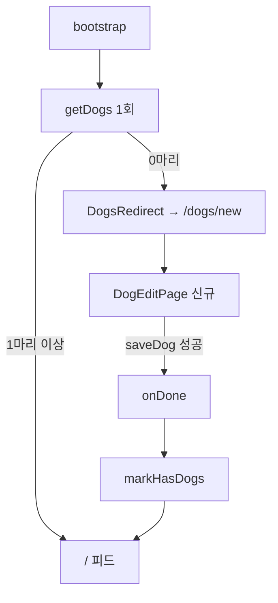

# W1 dog — 계획 (화면 · 상태 · 완료 조건)

> [pawlog 허브](../../README.md) · [기획 W1](../../overview.md#w1-dog--강아지) · [설계](../../../../../docs/superpowers/specs/2026-10-03-walk-app-design.md) · (완료 시 history.md · testing.md)

> 상태: 착수 2026-10-03 · 진행 상태의 단일 기준은 [진행 현황](../../status.md)

## 범위

강아지 프로필의 **등록 · 목록 · 수정 · 삭제 · 사진** 화면과 그 cubit 이다 (개발 단계 ④).
도메인 · 저장소는 ①② 에서 이미 섰다 — 화면은 `WalkUseCase` 의 강아지 메서드만 부른다.

| 이미 있는 것 (W1 이 쓰기만 한다) | 위치 |
|---|---|
| `Dog` · `DogDraft` 엔티티 | `packages/features/walk/lib/src/domain/entity/` |
| `watchDogs` · `getDog` · `saveDog` · `deleteDog` · `storePhoto` · `removePhoto` · `photoFile` | `WalkUseCase` |
| 이름 검증(trim 후 빈 값 → `FailureCode.dogNameRequired`) · 없는 강아지 → `targetNotFound` · 사진 교체 시 옛 파일 삭제 · 삭제 시 사진 파일 삭제 | `SaveDogScenario` · `DeleteDogScenario` |
| 이름순 목록 스트림 | `DriftDogRepository.watchAll` |
| 첫 실행 리다이렉트 `DogsRedirect` · `PawlogPaths` | `apps/pawlog/lib/app/router/dogs_redirect.dart` (③) |

W1 이 소유하지 않는 것: 산책 ↔ 강아지 연결(W2 선택 칩 · W3 저장 폼), 피드 AppBar 의
"강아지" 액션(W4 · ⑦). 페이지는 go_router 를 모른다 — 이동은 생성자 콜백으로만 한다.

## 화면 목록

| 화면 | 경로 | 진입 경로 |
|---|---|---|
| 목록 `DogListPage` | `/dogs` | 피드 AppBar 액션(⑦) · 첫 등록 이후 직접 진입 |
| 등록 `DogEditPage()` | `/dogs/new` | 첫 실행 리다이렉트 · 목록 FAB |
| 수정 `DogEditPage(dogId: id)` | `/dogs/:id` | 목록 행 탭 |

콜백: `DogListPage(onAddDog, onOpenDog(id))`, `DogEditPage({dogId, onDone})`.
앱 셸의 `onDone` 은 `markHasDogs()` 후 되돌아갈 곳이 있으면 `pop()`, 없으면(첫 실행) `go('/')`.

## 화면 상태

### `DogListState` (sealed)

| 상태 | 조건 | UI |
|---|---|---|
| `loading` | `start()` 직후 첫 값 전 | 중앙 진행 표시 |
| `loaded(dogs)` · 0마리 | 스트림 `Ok([])` | `AppPlaceholder(message: walkDogListEmptyTitle, description: walkDogListEmptyMessage, actionLabel: walkDogAddAction, onAction: onAddDog)` |
| `loaded(dogs)` · 1마리 이상 | 스트림 `Ok` | `AppListTile` 목록 + FAB |
| `failure(failure)` | 스트림 `Err` | `AppPlaceholder(message: failure.localizedMessage(context), actionLabel: commonRetry)` → `start()` 재구독 |

### `DogEditState` (sealed)

| 상태 | 조건 | UI |
|---|---|---|
| `loading` | `load(dogId)` 중 (수정만) | 중앙 진행 표시 |
| `editing(form, isSaving, failure?)` | 신규는 즉시, 수정은 `getDog` 성공 후 | 폼. `isSaving` 이면 저장 버튼 로딩 · 비활성. `failure` 가 새로 생기면 `AppSnackBar.show(type: error)` |
| `saved(dog)` | `saveDog` 성공 | `onDone()` (listener) |
| `deleted` | `deleteDog` 성공 | `onDone()` (listener) |
| `loadFailure(failure)` | `getDog` 이 `Err` 이거나 `Ok(null)`(→ `targetNotFound`) | `AppPlaceholder(message: failure.localizedMessage(context))` |

`loadFailure` 는 설계 §4 표에 없던 변형이다. 지워진 강아지를 빈 폼으로 보여 새로 만들게
되는 일을 막으려고 더한다 (폼 안의 저장 실패는 계속 `editing.failure`).

### 폼 모델 `DogForm` (presentation, Freezed 단일 모델)

| 필드 | 타입 | 의미 |
|---|---|---|
| `id` | `String?` | null 이면 신규 |
| `name` · `breed` | `String` | 입력값 그대로. `toDraft()` 에서 빈 `breed` 는 null |
| `birthday` | `DateTime?` | 날짜만 |
| `photoPath` | `String?` | 지금 보이는 사진(상대 경로) |
| `originalPhotoPath` | `String?` | 불러올 때의 사진. 버릴 파일 판단용 |

**사진 파일 규칙** (설계가 비워 둔 부분을 여기서 정한다):

1. 고르는 즉시 `storePhoto(bytes, extension)` 로 파일을 쓰고 `form.photoPath` 를 바꾼다
2. 다시 고르면, 직전 사진이 `originalPhotoPath` 가 아닐 때만 `removePhoto` 로 지운다
3. `close()` 에서 상태가 `saved` 가 아니고 `photoPath != originalPhotoPath` 면 `photoPath` 를
   지운다 (뒤로 가기 · 삭제 모두 해당). 저장되면 옛 파일은 `SaveDogScenario` 가 지운다

그래서 고아 파일은 "고른 뒤 앱 프로세스가 죽은 경우" 하나만 남는다 — v1 은 감수한다.

## 목록 항목

| 요소 | 값 | 없을 때 |
|---|---|---|
| 아바타 | `AppAvatar(nickname: dog.name, imageFile: photoFile(photoPath))` | 이름 첫 글자 (`AppAvatar` 기본 동작) |
| 이름 | `dog.name` | not null |
| 품종 | `dog.breed` (subtitle) | subtitle 생략 |
| 끝 | chevron 아이콘 (`trailing`) | — |

## 폼 규칙

| 항목 | 규칙 |
|---|---|
| 사진 | `AppAvatar`(크게) + `AppButton.text(walkDogPhotoChange)` → `getIt<ImagePickerService>().pickImage()` → null 이면 끝 → `prepare(xfile)` → `cubit.setPhoto(prepared)` (트레이더 `edit_profile_page` 선례). 파일 쓰기 실패는 `FailureCode.walkPhotoSaveFailed` 스낵바 |
| 이름 | 필수. trim 은 시나리오가 한다 — 페이지는 따로 막지 않고 `dogNameRequired` 스낵바로 알린다 |
| 품종 | 선택 |
| 생일 | `AppListTile` 탭 → `showDatePicker(firstDate: 2000-01-01, lastDate: 오늘)`. 로케일은 앱 `MaterialApp` 것을 따른다. 미설정이면 `walkDogBirthdayUnset` |
| 저장 | `AppButton.primary(walkDogSaveAction, isLoading: isSaving)`. 성공 → `saved` → `onDone()` |
| 삭제 | 기존 강아지만 AppBar `AppOverflowMenu` → `AppOverflowMenuItem(isDestructive: true)` → `AppConfirmDialog.show(isDestructive: true, confirmLabel: commonDelete)` → `delete()` → `deleted` → `onDone()` |
| 실패 | `AppSnackBar.show(message: failure.localizedMessage(context), type: AppSnackBarType.error)` |

## 갱신 규칙

목록은 `watchDogs()`(drift `watch`, 이름순) 를 구독하므로 저장 · 삭제 뒤 **수동 새로고침이
없다**. `DogListCubit.close()` 에서 구독을 끊는다. 모든 `await` 뒤 `isClosed` 검사.

## 첫 실행 흐름

## Presentation

| 이름 | 종류 | 내용 |
|---|---|---|
| `DogListCubit` | `@injectable`, 페이지 `BlocProvider` | `start()` — `watchDogs` 구독 |
| `DogEditCubit` | `@injectable`, 페이지 `BlocProvider` | `load(String? id)`, `setName` · `setBreed` · `setBirthday` · `setPhoto(PreparedImage)`, `save()`, `delete()` |
| `DogListState` · `DogEditState` | Freezed sealed union | `switch` 로 분기 |
| `DogForm` | Freezed 단일 모델 | 위 표 |

| 위젯 키 | 대상 |
|---|---|
| `walk-dog-list-tile-<id>` | 목록 행 |
| `walk-dog-add-fab` | 목록 FAB |
| `walk-dog-name-field` · `walk-dog-breed-field` | 이름 · 품종 입력 |
| `walk-dog-birthday-tile` | 생일 행 |
| `walk-dog-photo-button` | 사진 변경 |
| `walk-dog-save-button` | 저장 |
| `walk-dog-menu` | 더보기 메뉴 |

## 문자열

설계 §4 의 강아지 묶음을 따른다(ko 템플릿 + en · ja, 모든 키에 `@` 설명). 이미 있는
`commonCancel` · `commonDelete` · `commonRetry` · `commonMoreActions` · `commonSave` 는 재사용한다.

| 키 | ko |
|---|---|
| `walkDogListTitle` | 반려견 |
| `walkDogListEmptyTitle` | 등록된 반려견이 없습니다 |
| `walkDogListEmptyMessage` | 함께 산책할 반려견을 등록해 주세요 |
| `walkDogAddAction` | 반려견 추가 |
| `walkDogNewTitle` · `walkDogEditTitle` | 반려견 등록 · 반려견 수정 |
| `walkDogNameLabel` · `walkDogBreedLabel` · `walkDogBirthdayLabel` | 이름 · 품종 · 생일 |
| `walkDogBirthdayUnset` | 설정 안 함 |
| `walkDogPhotoChange` | 사진 변경 |
| `walkDogSaveAction` · `walkDogDeleteAction` | 저장 · 삭제 |
| `walkDogDeleteConfirmTitle` | 반려견을 삭제할까요? |
| `walkDogDeleteConfirmMessage` | 산책 기록은 남고, 기록에서 이 반려견만 빠집니다. |

## 완료 조건

- [ ] 등록 → 목록에 이름순으로 보인다 → 수정 → 삭제
- [ ] 사진 교체 시 옛 파일이 지워지고, 저장하지 않고 나가면 새로 고른 파일이 지워진다
- [ ] 첫 실행(0마리) → `/dogs/new` → 저장 → 피드
- [ ] 강아지 삭제 후에도 산책 기록이 남는다 (레포 테스트로 이미 확인, 화면에서 재확인)
- [ ] cubit 테스트 (`bloc_test`)
- [ ] 페이지 테스트 — `getIt` 에 mock `WalkUseCase` 등록, `tearDown(getIt.reset)`, `Locale('ko')`
- [ ] `flutter analyze` 0건, `package_boundary_test` 통과

## 테스트

| 대상 | 시나리오 | 기대 결과 |
|---|---|---|
| `DogListCubit` | 스트림이 강아지 2마리를 낸다 | `loading` → `loaded([2마리])` |
| `DogListCubit` | 스트림이 `Err` 를 낸다 | `failure(failure)` |
| `DogListCubit` | 닫힌 뒤 스트림 값 | 상태를 내지 않는다(구독 해제) |
| `DogEditCubit` | `load(null)` | `editing(빈 폼)` |
| `DogEditCubit` | `load(id)` · 강아지 있음 | `loading` → `editing(값이 채워진 폼)` |
| `DogEditCubit` | 이름 공백으로 `save()` | `isSaving` 거쳐 `editing(failure: dogNameRequired)` |
| `DogEditCubit` | 정상 `save()` | `saveDog(DogDraft)` 호출 · `saved(dog)` |
| `DogEditCubit` | `setPhoto` 두 번 | 첫 새 파일 `removePhoto`, `photoPath` 는 둘째 |
| `DogEditCubit` | 사진 고르고 저장 없이 `close()` | 새 파일 `removePhoto`, 원래 사진은 그대로 |
| `DogEditCubit` | `delete()` | `deleteDog(id)` · `deleted` |
| `DogListPage` | 0마리 | `AppPlaceholder` + 추가 버튼 → `onAddDog` |
| `DogListPage` | 2마리 | 행 2개 · 품종 subtitle · 행 탭 → `onOpenDog(id)` |
| `DogEditPage` | 신규 | 메뉴 없음, 제목 `walkDogNewTitle` |
| `DogEditPage` | 이름 입력 후 저장 | `onDone` 호출 |
| `DogEditPage` | 저장 실패 | 스낵바에 실패 문구 |
| `DogEditPage` | 메뉴 → 삭제 → 확인 | `deleteDog` · `onDone` |
| `DogEditPage` | 메뉴 → 삭제 → 취소 | `deleteDog` 호출 없음 |

## 범위 밖

- 강아지당 사진 여러 장, 몸무게 · 메모 필드
- 목록 순서 바꾸기 (이름순 고정)
- 마지막 강아지 삭제 막기 — [기획 §9 남은 판단](../../overview.md#남은-판단-착수-시-결정). v1 은 막지 않고,
  재실행 전까지 W2 시작 버튼이 비활성인 것으로 충분한지 W2 에서 본다
- 강아지별 산책 통계
- 카메라 촬영(`captureImage`) — 강아지 사진은 앨범 한 장만
