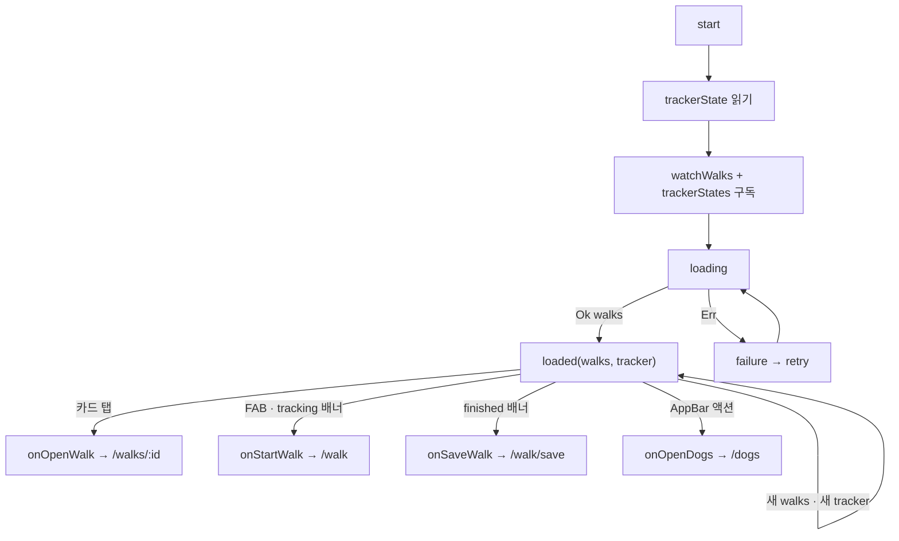

# W4 feed — 계획 (화면 · 상태 · 완료 조건)

> [pawlog 허브](../../README.md) · [기획 W4](../../overview.md#w4-feed--피드) · [설계](../../../../../docs/superpowers/specs/2026-10-03-walk-app-design.md) · (완료 시 history.md · testing.md)

> 상태: 착수 전 · 진행 상태의 단일 기준은 [진행 현황](../../status.md)

## 범위

앱의 첫 화면 — **내 산책 기록의 최신순 타임라인**과 추적 상태 배너 · FAB, 그 cubit 이다
(개발 단계 ⑦, W3 상세와 함께). 피드는 기록을 읽기만 한다 — 저장 · 수정 · 삭제는
[W3](../record/plan.md), 추적은 [W2](../tracking/plan.md) 가 한다.

| 이미 있는 것 (W4 가 쓰기만 한다) | 위치 |
|---|---|
| `Walk(id, startedAt, endedAt, duration, distanceMeters, memo?, dogs, photos, previewPoints, …)` — 전체 경로 없음, `previewPoints` ≤ 64점 | `packages/features/walk/lib/src/domain/entity/walk.dart` |
| `watchWalks()` — `started_at` 내림차순(동률은 `id` 내림차순), 강아지 · 사진을 join, 사진은 `position` 순 | `DriftWalkRepository.watchAll` |
| `trackerState` · `trackerStates`(브로드캐스트, 현재값을 먼저 내지 않는다) · `photoFile` | `WalkUseCase` |
| sealed `TrackerState`(`idle` / `tracking(session)` / `finished(session)`) | `domain/entity/tracker_state.dart` |
| `WalkStatsRow` · `WalkFormat.distance` · `WalkFormat.duration` | W2 |
| `DogAvatars` | W3 |
| `DateTime.displayDateTime(localeName)` | `packages/core/lib/src/extension/date_time_format.dart` |
| 경로 `PawlogPaths.feed = '/'` (지금은 `_Placeholder` + 임시 "dogs" 버튼) | `apps/pawlog/lib/app/router/` |

drift `watch()` 가 `walks` · `walk_dogs` · `dogs` · `walk_photos` 를 모두 보므로 저장 · 수정 ·
삭제 · **강아지 이름 변경**이 그대로 흐른다. 그래서 "돌아오면 새로고침" 콜백이 없다.

## 화면 목록

| 화면 | 경로 | 진입 경로 |
|---|---|---|
| 피드 `WalkFeedPage` | `/` | 앱 시작(`initialLocation`) · 저장 · 버리기 · 삭제 뒤 |

콜백: `WalkFeedPage({onStartWalk, onSaveWalk, onOpenWalk(id), onOpenDogs})`. 앱 셸은
`onStartWalk` → `push(PawlogPaths.activeWalk)`, `onSaveWalk` → `push(PawlogPaths.saveWalk)`,
`onOpenWalk` → `push(PawlogPaths.walk(id))`, `onOpenDogs` → `push(PawlogPaths.dogs)`.

`onSaveWalk` 는 설계 §4 에 없던 콜백이다. `finished` 배너를 `onStartWalk` 로 보내도 W2 가
`stopped` → `/walk/save` 로 넘기지만, 진행 화면이 잠깐 비쳤다 사라지므로 바로 보낸다.

라우터 정리: 지금의 `/walks` 자리표시자(산책 목록)는 피드와 겹친다. ⑦ 에서 그 `GoRoute` 를
`redirect: → PawlogPaths.feed` 로 바꾸고 하위 `:id` · `:id/edit` 는 그대로 둔다.

## 화면 상태 — `WalkFeedState` (sealed)

| 상태 | 조건 | UI |
|---|---|---|
| `loading` | `start()` 직후 첫 `watchWalks` 값 전 | 중앙 진행 표시 |
| `loaded(walks, tracker)` · 0건 | 스트림 `Ok([])` | 배너(있으면) + `AppPlaceholder(message: walkFeedEmptyTitle, description: walkFeedEmptyMessage, actionLabel: walkStart, onAction: onStartWalk)`. FAB 없음 |
| `loaded(walks, tracker)` · 1건 이상 | 스트림 `Ok` | 배너(있으면) + `WalkCard` 목록 + FAB |
| `failure(failure)` | 스트림 `Err` | `AppPlaceholder(message: failure.localizedMessage(context), actionLabel: commonRetry, onAction: retry)` |

**결정: `isTracking: bool` 대신 `tracker: TrackerState` 를 든다.** 설계 §4 의
`loaded(walks, isTracking)` 로는 "추적 중" 과 "끝났지만 저장 안 함(`finished`)" 을 가를 수
없다. 둘은 배너 문구도, 가는 곳도 다르다.

| `tracker` | 배너 `ActiveWalkBanner` | FAB |
|---|---|---|
| `idle` | 없음 | `walkStart` → `onStartWalk` |
| `tracking(session)` | `walkInProgressBanner` + `WalkStatsRow`(거리 · 진입 시점 경과 시간) → 탭 `onStartWalk` | `walkContinue` → `onStartWalk` |
| `finished(session)` | `walkUnsavedBanner` → 탭 `onSaveWalk` | **숨긴다** — 저장 · 버리기 전에 새 산책을 시작하지 않게 |

배너의 경과 시간은 피드에서 초 단위로 갱신하지 않는다(타이머 없음). 새 점이 올 때
`trackerStates` 로 거리와 함께 바뀌는 정도로 충분하다.

## 상태 규칙

| 항목 | 규칙 |
|---|---|
| 시작 | `start()` 가 `trackerState` 를 **먼저 읽어** 보관하고, `trackerStates` · `watchWalks()` 를 구독한다 |
| 합치기 | 마지막 `walks` 와 마지막 `tracker` 를 보관해, 어느 쪽이 와도 `loaded(walks, tracker)` 를 다시 낸다. `walks` 가 아직 없으면 `tracker` 만 바꾸고 `loading` 유지 |
| 실패 | `watchWalks` 의 `Err` → `failure`. 이후 `tracker` 변화는 무시 |
| 재시도 | `retry()` 가 `watchWalks` 구독만 끊고 다시 건다(`loading` 부터) |
| 정리 | `close()` 에서 두 구독 해제. 모든 비동기 뒤 `isClosed` 검사 |
| 전체 로드 | v1 은 페이지네이션 없이 전부 읽는다 — `Walk` 에 경로가 없어 가볍다. v2 에서 `CursorPage` · `AppLoadMoreListener` · `AppListFooter` |

## 카드 `WalkCard`

| 요소 | 값 | 없을 때 |
|---|---|---|
| 강아지 | `DogAvatars(dogs)` — 겹친 `AppAvatar(nickname: dog.name, imageFile: photoFile(photoPath))`, 최대 3 + `+n` | 강아지가 모두 삭제된 산책: 아바타 줄 생략 |
| 날짜 | `startedAt.displayDateTime(l10n.localeName)` | not null |
| 통계 | `WalkStatsRow` 압축형 — `WalkFormat.distance` · `WalkFormat.duration(walk.duration)` | — |
| 썸네일 | 첫 사진 `Image.file(photoFile(photos.first.path), fit: cover)`, 파일이 없으면 `errorBuilder` 로 경로 썸네일 | `CustomPaint(painter: RoutePreviewPainter(previewPoints, color: colorScheme.primary))`. 점 2개 미만이면 아이콘만 |
| 메모 | `maxLines: 2`, `overflow: ellipsis` | 줄 생략(빈 문구 키를 두지 않는다) |
| 탭 | 카드 전체 → `onOpenWalk(walk.id)` | — |

- 바탕은 Material `Card`(테마 `cardTheme`) + `InkWell`, 모서리 `AppRadius.lgAll`, 여백 `AppSpacing`.
  `design_system` 에 카드 위젯이 없고 `AppListTile` 은 썸네일 큰 행을 담지 못한다. 쓰는 곳이
  피드 하나라 승격하지 않는다
- `RoutePreviewPainter`: 점들의 경계 상자를 비율을 유지한 채 캔버스에 맞추고 폴리라인만
  그린다(타일 없음, [기획 §9 #4](../../overview.md#확정)). `shouldRepaint` 는 점 목록 · 색 비교
- 썸네일은 `cacheWidth` 로 디코드 크기를 줄인다(사진이 많아도 피드가 가볍게)

## AppBar · FAB

| 항목 | 값 |
|---|---|
| 제목 | `walkAppTitle`(이미 있음, "pawlog") |
| 액션 | `IconButton(Icons.pets, tooltip: walkOpenDogsTooltip)` → `onOpenDogs` |
| FAB | `FloatingActionButton.extended` — 위 표의 라벨. 공통 FAB 위젯이 없고 W1 목록 FAB 와 같은 선택 |

## Presentation

| 이름 | 종류 | 내용 |
|---|---|---|
| `WalkFeedCubit` | `@injectable`, 페이지 `BlocProvider` | `start()`, `retry()`, `photoFile(path)` |
| `WalkFeedState` | Freezed sealed union | `loading` / `loaded(walks, tracker)` / `failure(failure)`. `switch` 로 분기 |
| `WalkCard` · `RoutePreviewPainter` · `ActiveWalkBanner` | `presentation/widget/` | 위 절 |

| 위젯 키 | 대상 |
|---|---|
| `walk-feed-card-<id>` | 카드 |
| `walk-feed-fab` | FAB |
| `walk-feed-banner` | 추적 중 · 저장 안 함 배너 |
| `walk-feed-open-dogs` | AppBar 강아지 액션 |
| `walk-feed-retry` | 실패 재시도 |

## 문자열

ko 템플릿 + en · ja, 모든 키에 `@` 설명. 재사용: `walkAppTitle` · `commonRetry`,
W2 가 추가하는 `walkStart` · `walkDistance*` · `walkDuration*`. 설계 §4 의 피드 묶음
(`walkFeedStartAction` 등) 대신 이 표를 따른다. `walkFeedTitle` 은 만들지 않는다 —
제목은 `walkAppTitle` 이다.

| 키 | ko |
|---|---|
| `walkFeedEmptyTitle` | 첫 산책을 시작해 보세요 |
| `walkFeedEmptyMessage` | 산책을 마치면 여기에 기록이 쌓입니다 |
| `walkContinue` | 산책 계속 |
| `walkInProgressBanner` | 산책 중이에요 · 눌러서 돌아가기 |
| `walkUnsavedBanner` | 저장하지 않은 산책이 있어요 · 눌러서 저장하기 |
| `walkOpenDogsTooltip` | 반려견 |

## 완료 조건

- [ ] 빈 피드(`AppPlaceholder` + 시작) → 산책 저장 → 카드가 맨 위에 생긴다
- [ ] 카드 → 상세 → 삭제 → 피드에서 사라진다 (새로고침 없이)
- [ ] 강아지 이름 · 사진 변경이 카드에 반영된다
- [ ] 추적 중 배너 · "산책 계속" FAB → `/walk`, 종료 후 저장 전이면 "저장하지 않은 산책" 배너 → `/walk/save`, FAB 없음
- [ ] 사진 있는 카드는 첫 사진, 없는 카드는 경로 썸네일. 다크 모드에서 썸네일 선이 보인다
- [ ] `/walks` 가 피드로 리다이렉트된다. 임시 `_Placeholder` 제거
- [ ] cubit · 위젯 · 페이지 테스트, `flutter analyze` 0건, `package_boundary_test` 통과

## 테스트

| 대상 | 시나리오 | 기대 결과 |
|---|---|---|
| `WalkFeedCubit` | `idle` + 스트림 2건 | `loading` → `loaded([2건], idle)` |
| `WalkFeedCubit` | 스트림이 새 목록을 낸다 | `loaded` 갱신 |
| `WalkFeedCubit` | 시작 시 `trackerState` 가 `tracking` | 첫 `loaded` 부터 `tracking` |
| `WalkFeedCubit` | `trackerStates` 가 `finished` 를 낸다 | `loaded(walks, finished)` |
| `WalkFeedCubit` | 스트림 `Err` → `retry()` | `failure` → `loading` → `loaded`, 재구독 1회 |
| `WalkFeedCubit` | 닫힌 뒤 값 | 상태를 내지 않는다 |
| `RoutePreviewPainter` | 점 0 · 1 · 여러 개 | 예외 없이 그린다(`paint` 를 `Canvas` 기록으로 호출) |
| `WalkFeedPage` | 0건 | `AppPlaceholder` + 시작 버튼 → `onStartWalk` |
| `WalkFeedPage` | 2건 | 카드 2개 · 날짜 · 거리, 카드 탭 → `onOpenWalk(id)` |
| `WalkFeedPage` | 사진 있음 / 없음 | `Image` / `CustomPaint` |
| `WalkFeedPage` | `tracking` | 배너 + FAB `walkContinue`, 둘 다 → `onStartWalk` |
| `WalkFeedPage` | `finished` | `walkUnsavedBanner` → `onSaveWalk`, FAB 없음 |
| `WalkFeedPage` | AppBar 액션 · 실패 재시도 | `onOpenDogs` · `retry` |

페이지 테스트는 `getIt` 에 mock `WalkUseCase` 를 등록하고 `tearDown(getIt.reset)`,
`Locale('ko')`. 사진은 임시 디렉터리의 작은 PNG 를 `photoFile` 이 돌려주게 한다.

## 범위 밖

- 페이지네이션 — v1 은 전체 로드([기획 §3 제외](../../overview.md#제외-v1-범위-밖))
- 날짜별 묶음 머리글("오늘 · 어제 · 이번 주") — v1 은 단순 목록
- 강아지별 필터 · 검색
- 통계 대시보드(주간 거리 등)
- 공유 · 다른 사람의 피드 · 좋아요 — W5 social
- 당겨서 새로고침 — 스트림이라 필요 없다
