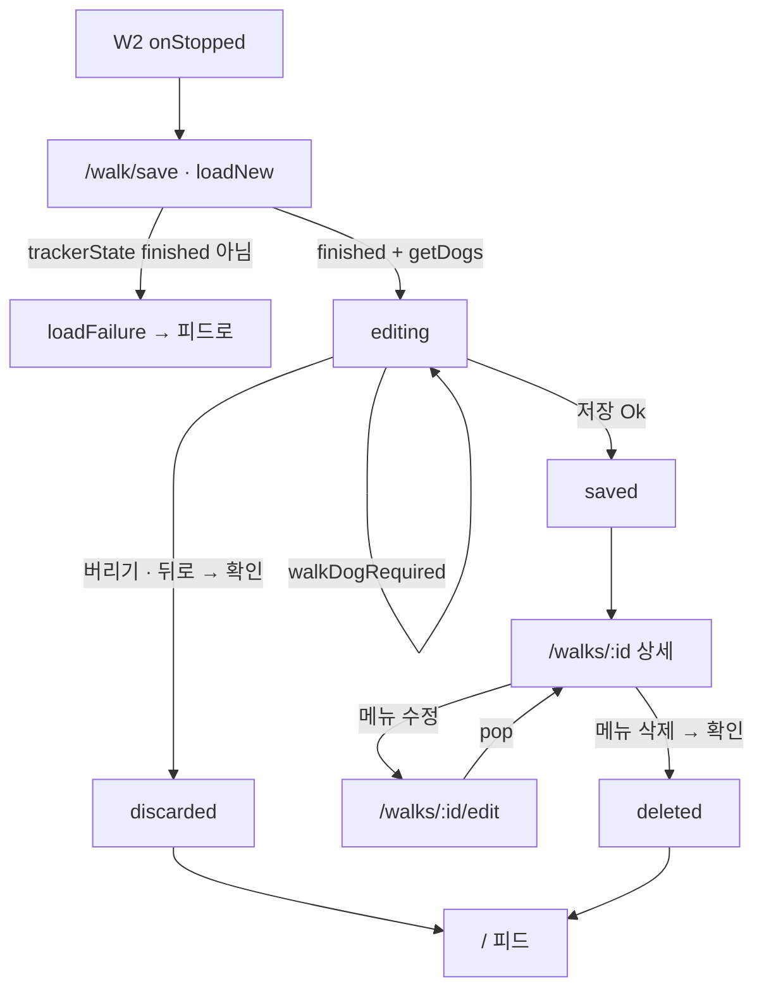

# W3 record — 계획 (화면 · 상태 · 완료 조건)

> [pawlog 허브](../../README.md) · [기획 W3](../../overview.md#w3-record--산책-기록) · [설계](../../../../../docs/superpowers/specs/2026-10-03-walk-app-design.md) · [구현 기록](history.md) · [테스트](testing.md)

> 상태: 구현 완료 2026-10-03 (`93d722b`) · 리뷰 ⑥ 보류(W1 상세 진입 불가 → `d5f95b0` 에서 수정) · 에뮬레이터 확인 전 · 진행 상태의 단일 기준은 [진행 현황](../../status.md)

## 범위

끝난 산책의 **저장 · 수정 · 버리기 · 상세 · 삭제** 화면과 그 cubit 이다. 저장 폼은 단계 ⑥, 상세는 ⑦ 에서
피드와 함께([기획 §8](../../overview.md#8-개발-단계)). 도메인 · 지도 · 포맷은 이미 섰다 — 화면은 `WalkUseCase` 만 부른다.

| 이미 있는 것 (W3 가 쓰기만 한다) | 위치 |
|---|---|
| `Walk` · `WalkDraft` · `WalkUpdate` · `WalkPhoto(id, path, position)` · `WalkSession` · sealed `TrackerState` | `packages/features/walk/lib/src/domain/entity/` |
| `saveWalk` → `Result<Walk>` · `updateWalk` → `Result<Walk>` · `deleteWalk` · `getWalk` → `Result<Walk?>` · `getWalkTrack` · `getDogs` · `storePhoto({bytes, extension})` · `removePhoto` · `photoFile` · `discardWalk({photoPaths})` · `trackerState` | `WalkUseCase` |
| `dogIds` 가 비었거나 **모두 삭제된 강아지**면 `walkDogRequired`, 64점 프리뷰, 저장 성공 후 `tracker.clear()` | `SaveWalkScenario` |
| 없는 산책 → `walkNotFound`, 남는 사진은 **기존 `WalkPhoto.id` 유지**, DB 성공 뒤 목록에서 빠진 파일만 삭제 | `UpdateWalkScenario` |
| 행 삭제 → 사진 파일 best-effort, 없는 산책 → `walkNotFound` | `DeleteWalkScenario` |
| 파일 삭제 → `tracker.clear()`(**`finished` 에서만** `idle`) | `DiscardWalkScenario` |
| `RouteMap({points, follow, emptyMessage})` · `WalkStatsRow` · `DogChips` · `WalkFormat` | W2 — [tracking 계획](../tracking/plan.md) |
| `ImagePickerService.pickImages({limit})` → `List<PreparedImage>` · `captureImage()` → `PreparedImage?` | `packages/core/lib/src/media/` |
| 경로 `PawlogPaths.saveWalk` · `walk(id)` · `walkEdit(id)` (지금은 `_Placeholder`) | `apps/pawlog/lib/app/router/` |

W3 가 소유하지 않는 것: 피드 카드 · 배너(W4), 추적 시작 · 종료(W2).

## 화면 목록

| 화면 | 경로 | 진입 경로 |
|---|---|---|
| 저장 `WalkEditPage.create()` | `/walk/save` | W2 `onStopped`(`pushReplacement`) · 피드의 "저장하지 않은 산책" 배너(W4) |
| 수정 `WalkEditPage.edit(walkId)` | `/walks/:id/edit` | 상세 더보기 → 수정 |
| 상세 `WalkDetailPage(walkId)` | `/walks/:id` | 저장 직후 · 피드 카드(W4) |

콜백과 앱 셸 연결:

| 페이지 | 콜백 | 앱 셸 |
|---|---|---|
| `WalkEditPage.create` | `onSaved(id)` · `onDiscarded()` | `go(PawlogPaths.feed)` 후 `push(PawlogPaths.walk(id))` — 스택이 피드 → 상세가 되게 · `go(PawlogPaths.feed)` |
| `WalkEditPage.edit` | `onSaved(id)` · `onDiscarded()` | 둘 다 `pop()` |
| `WalkDetailPage` | `onEdit(id)` → `Future<void>` · `onDeleted()` | `push(PawlogPaths.walkEdit(id))` 의 Future 를 그대로 돌려준다 · `canPop()` 이면 `pop()`, 아니면 `go(PawlogPaths.feed)` |

`onEdit` 이 Future 를 돌려주는 이유: 상세는 스트림이 아니라서 수정에서 돌아오면 **다시
읽어야 한다.** 통근 앱 `OpenSettingsCallback`(`Future<void> Function()`)과 같은 방식이다.

## 화면 상태

### `WalkEditState` (sealed)

| 상태 | 조건 | UI |
|---|---|---|
| `loading` | `loadNew()` · `loadExisting(id)` 중 | 중앙 진행 표시 |
| `editing(form, isSaving, failure?)` | 불러오기 성공 | 폼. `isSaving` 이면 저장 버튼 로딩 · 입력 비활성. `failure` 가 새로 생기면 `AppSnackBar.show(type: error)` |
| `saved(walkId)` | `saveWalk` · `updateWalk` 성공 | listener → `onSaved(walkId)` |
| `discarded` | 신규 폼 버리기 완료 | listener → `onDiscarded()` |
| `loadFailure(failure)` | 신규: `trackerState` 가 `finished` 가 아님 → `walkNotFound`. 수정: `getWalk` 가 `Err` 이거나 `Ok(null)` → `walkNotFound`. `getDogs` 실패 | 신규면 `AppPlaceholder(message: walkNoSessionToSave, actionLabel: walkBackToFeed, onAction: onDiscarded)`, 수정이면 `AppPlaceholder(message: failure.localizedMessage(context))` |

`loadFailure` 는 설계 §4 에 없던 변형이다 — W1 `DogEditState.loadFailure` 처럼, 세션 없이 빈 폼을 보이지 않게 더한다.

### 폼 모델 `WalkEditForm` (presentation, Freezed 단일 모델)

| 필드 | 타입 | 의미 |
|---|---|---|
| `dogs` | `List<Dog>` | 칩으로 보일 전체 강아지(`getDogs`, 이름순) |
| `selectedDogIds` | `Set<String>` | 신규: `session.dogIds ∩ dogs` **전부 기본 선택**. 수정: `walk.dogs` 의 id |
| `memo` | `String` | 입력값 그대로. 변환 시 trim 후 빈 값은 null |
| `photoPaths` | `List<String>` | 지금 보이는 사진(상대 경로, 순서 = `position`) |
| `session` | `WalkSession?` | 신규만. 요약 헤더 · `WalkDraft` 재료 |
| `existing` | `Walk?` | 수정만. 요약 헤더 · 원래 사진 판단 |

- `addedPhotoPaths` = `photoPaths` 중 `existing.photos` 에 없는 것(신규면 전부) — 이번 폼에서 쓴 파일
- `toDraft()` → `WalkDraft(startedAt, endedAt, distanceMeters, points: session.points, dogIds, memo, photoPaths)`
- `toUpdate()` → `WalkUpdate(id: existing.id, dogIds, memo, photoPaths)`
- 상수 `maxPhotos = 10`([기획 §9 #6](../../overview.md#확정))

## 폼 규칙

| 항목 | 규칙 |
|---|---|
| 요약 헤더 | 날짜(`startedAt.displayDateTime(l10n.localeName)`) + `WalkStatsRow`(거리 · 시간). 수정에서도 바뀌지 않는다 |
| 강아지 | `DogChips(dogs, selectedIds, onToggle: cubit.toggleDog)`. 0개 선택은 막지 않는다 — 저장 시 `walkDogRequired` 스낵바 |
| 메모 | 여러 줄 `TextField`(`walkMemoLabel` · `walkMemoHint`) → `setMemo` |
| 사진 추가 | `PhotoStrip` 끝의 추가 칸 → `PhotoSourceSheet`(`walkAddPhotoFromGallery` · `walkAddPhotoFromCamera`). 앨범은 `pickImages(limit: maxPhotos - count)`, 카메라는 `captureImage()`. 취소 · 빈 목록이면 끝 → `cubit.addPhotos(images)` |
| 저장 순서 | `addPhotos` 는 한 장씩 `storePhoto(bytes, extension)` → 성공 경로를 `photoPaths` 끝에 붙인다. 넘치는 몫은 버린다. 실패는 `walkPhotoSaveFailed` 스낵바, 나머지는 계속 |
| 10장 | `count == maxPhotos` 면 추가 칸 대신 `walkPhotoLimitReached` 캡션 |
| 사진 빼기 | 각 썸네일의 x → `removePhoto(index)`. **이번 폼에서 추가한 파일만** 즉시 `removePhoto(path)`. 기존 사진은 목록에서만 빼고, 파일은 저장 성공 뒤 `UpdateWalkScenario` 가 지운다 |
| 저장 | `AppButton.primary(commonSave, isLoading: isSaving)` → 신규 `saveWalk(toDraft())`, 수정 `updateWalk(toUpdate())` → `saved(walk.id)` |
| 버리기 (신규) | `AppButton.text(walkDiscard)` → `AppConfirmDialog.show(isDestructive: true, title: walkDiscardConfirmTitle, content: walkDiscardConfirmMessage, confirmLabel: walkDiscard)` → `discard()` → `discardWalk(photoPaths: addedPhotoPaths)` → `discarded` |
| 뒤로 (신규) | `PopScope(canPop: false)` → 버리기와 **같은 확인**. 그냥 나가면 `finished` 세션이 남아 W2 가 새 산책을 막는다 |
| 뒤로 (수정) | 막지 않는다. 버리기 버튼도 없다 |
| 실패 | `AppSnackBar.show(message: failure.localizedMessage(context), type: AppSnackBarType.error)` |

**사진 파일 규칙** (W1 [폼 규칙](../dog/plan.md)과 같은 원칙):

1. 고르는 즉시 파일에 쓴다. 이번 폼에서 쓴 파일은 저장되지 않으면 지운다
2. **수정 모드는 `discardWalk` 를 부르지 않는다** — 그 안의 `tracker.clear()` 가 다른
   `finished` 세션(저장 대기 중)을 지울 수 있다. 수정 모드 정리는 `removePhoto` 만 쓴다
3. `close()` 에서 `saved` · `discarded` 가 아니면 `addedPhotoPaths` 를 `removePhoto`.
   신규 모드라도 여기서는 `tracker.clear()` 를 하지 않는다 — 세션은 피드 배너로 다시 온다
4. `addPhotos` 도중 닫히면 방금 쓴 파일을 바로 지운다(`DogEditCubit.setPhoto` 와 같다)

## 상세 규칙

| 항목 | 규칙 |
|---|---|
| 불러오기 | `load(id)` 가 `getWalk(id)` · `getWalkTrack(id)` 를 **함께**(`Future.wait`) 부른다. `Ok(null)` → `walkNotFound` |
| 지도 | `RouteMap(points: track 의 point, follow: false, emptyMessage: walkNoTrack)` |
| 통계 | 날짜 + `WalkStatsRow(distanceMeters, duration)` |
| 강아지 | `walkDogsLabel` + `DogAvatars(dogs)`(W4 와 공유) + 이름 쉼표 연결 |
| 사진 | `WalkPhotoGrid` — 3열, `Image.file(photoFile(path), fit: cover)`, `ClipRRect(borderRadius: AppRadius.smAll)`. 없으면 절 생략 |
| 메모 | 있으면 본문, 없으면 절 생략 |
| 메뉴 | AppBar `AppOverflowMenu` → `walkEdit` · `commonDelete`(`isDestructive: true`). 수정 → `await onEdit(id)` → `load(id)` 다시 |
| 삭제 | `AppConfirmDialog.show(isDestructive: true, title: walkDeleteConfirmTitle, content: walkDeleteConfirmMessage, confirmLabel: commonDelete)` → `delete()` → `deleting` → `deleted` → `onDeleted()` |

### `WalkDetailState` (sealed)

| 상태 | 조건 | UI |
|---|---|---|
| `loading` | `load` 중 | 중앙 진행 표시 |
| `loaded(walk, track, failure?)` | 둘 다 `Ok` | 위 표. `failure`(삭제 실패)가 새로 생기면 스낵바 |
| `deleting(walk, track)` | `deleteWalk` 중 | 내용 유지, 메뉴 비활성 |
| `deleted` | `deleteWalk` 성공 | listener → `onDeleted()` |
| `failure(failure)` | 불러오기 실패 | `AppPlaceholder(message: failure.localizedMessage(context), actionLabel: commonRetry)` → `load(id)` |

설계 §4 의 `deleting` · `loaded` 에 데이터와 `failure?` 를 더했다 — 삭제가 실패해도 화면이 비지 않게.

## Presentation

| 이름 | 종류 | 내용 |
|---|---|---|
| `WalkEditCubit` | `@injectable`, 페이지 `BlocProvider` | `loadNew()`, `loadExisting(id)`, `toggleDog(id)`, `setMemo(text)`, `addPhotos(List<PreparedImage>)`, `removePhoto(index)`, `save()`, `discard()`, `photoFile(path)` |
| `WalkDetailCubit` | `@injectable`, 페이지 `BlocProvider` | `load(id)`, `delete()`, `photoFile(path)` |
| `WalkEditState` · `WalkDetailState` | Freezed sealed union | 위 표. `switch` 로 분기 |
| `WalkEditForm` | Freezed 단일 모델 | 위 표 |
| `PhotoStrip` · `PhotoSourceSheet` · `WalkPhotoGrid` · `DogAvatars` | `presentation/widget/` | 사진 띠 · 앨범/카메라 시트 · 상세 그리드 · 겹친 아바타(W4 공유) |

| 위젯 키 | 대상 |
|---|---|
| `walk-edit-dog-chip-<id>` | 강아지 칩 |
| `walk-edit-memo-field` | 메모 입력 |
| `walk-edit-add-photo` | 사진 추가 칸 |
| `walk-edit-photo-<index>` · `walk-edit-remove-photo-<index>` | 썸네일 · 빼기 버튼 |
| `walk-edit-save-button` · `walk-edit-discard-button` | 저장 · 버리기 |
| `walk-detail-menu` · `walk-detail-map` · `walk-detail-photo-<index>` | 더보기 · 지도 · 사진 |

## 문자열

ko 템플릿 + en · ja, 모든 키에 `@` 설명. 설계 §4 의 키 이름 대신 이 표를 따른다(W2 와
같은 방식). 재사용: `commonSave` · `commonDelete` · `commonCancel` · `commonRetry` ·
`commonMoreActions`, `failureWalkDogRequired` · `failureWalkNotFound` ·
`failureWalkPhotoSaveFailed`, W2 가 추가하는 `walkSelectDogs` · `walkDistanceLabel` ·
`walkElapsedLabel` · `walkDistance*` · `walkDuration*`. 아래는 모두 새 키다.

| 키 | ko |
|---|---|
| `walkEditNewTitle` · `walkEditTitle` | 산책 저장 · 산책 수정 |
| `walkMemoLabel` · `walkMemoHint` | 메모 · 오늘 산책은 어땠나요? |
| `walkPhotosLabel` · `walkAddPhoto` | 사진 · 사진 추가 |
| `walkAddPhotoFromGallery` · `walkAddPhotoFromCamera` | 앨범에서 고르기 · 카메라로 찍기 |
| `walkPhotoLimitReached` | 사진은 최대 10장까지 붙일 수 있어요 |
| `walkDiscard` | 버리기 |
| `walkDiscardConfirmTitle` · `walkDiscardConfirmMessage` | 이 산책을 버릴까요? · 경로와 붙인 사진이 모두 지워집니다. |
| `walkNoSessionToSave` · `walkBackToFeed` | 저장할 산책이 없습니다 · 피드로 돌아가기 |
| `walkDetailTitle` · `walkEdit` | 산책 기록 · 수정 |
| `walkDeleteConfirmTitle` · `walkDeleteConfirmMessage` | 산책 기록을 삭제할까요? · 경로와 사진이 함께 삭제됩니다. |
| `walkNoTrack` | 기록된 경로가 없습니다 |
| `walkDogsLabel` · `walkDateLabel` | 함께한 반려견 · 날짜 |

## 완료 조건

- [ ] 종료 → `/walk/save` → 사진 2장 + 메모 → 저장 → 상세 → 뒤로 → 피드
- [ ] 상세 → 수정(메모 · 사진 하나 빼기) → 돌아오면 상세가 다시 읽힌다
- [ ] 상세 → 삭제 → 피드. `adb shell run-as com.karma.pawlog ls files/pawlog_photos` 에서 파일이 사라진다
- [ ] 저장 폼에서 버리기 · 뒤로 → 확인 → 사진 파일 삭제, 추적기 `idle`
- [ ] `trackerState` 가 `finished` 가 아닐 때 `/walk/save` → 안내 + 피드로
- [ ] cubit 테스트(`bloc_test`) · 페이지 테스트(mock `WalkUseCase` · stub `TileProvider` · mock `ImagePickerService`)
- [ ] `flutter analyze` 0건, `package_boundary_test` 통과

## 테스트

| 대상 | 시나리오 | 기대 결과 |
|---|---|---|
| `WalkEditCubit` | `loadNew` · `finished(session)` | `editing(session, 세션 강아지 전부 선택)` |
| `WalkEditCubit` | `loadNew` · `idle` / `tracking` | `loadFailure(walkNotFound)` |
| `WalkEditCubit` | `loadExisting(id)` · `Ok(null)` | `loadFailure(walkNotFound)` |
| `WalkEditCubit` | `addPhotos` 2장 | `storePhoto` 2회, `photoPaths` 끝에 순서대로 |
| `WalkEditCubit` | 9장에서 `addPhotos` 3장 | 1장만 저장, 10장 |
| `WalkEditCubit` | 새 사진 · 기존 사진 `removePhoto` | 새 것만 파일 삭제, 기존 것은 목록에서만 |
| `WalkEditCubit` | 정상 `save()` (신규 / 수정) | `saveWalk(WalkDraft)` / `updateWalk(WalkUpdate)` → `saved(id)` |
| `WalkEditCubit` | `save()` 가 `walkDogRequired` | `isSaving` 거쳐 `editing(failure)` |
| `WalkEditCubit` | 신규 `discard()` | `discardWalk(photoPaths: 추가분)` → `discarded` |
| `WalkEditCubit` | 수정 중 사진 추가 후 `close()` | 추가분 `removePhoto`, `discardWalk` 호출 없음 |
| `WalkDetailCubit` | `load(id)` | `getWalk` · `getWalkTrack` 호출 → `loaded(walk, track)` |
| `WalkDetailCubit` | `delete()` 성공 / 실패 | `deleting` → `deleted` / `loaded(failure)` |
| `WalkEditPage` | 강아지 모두 해제 후 저장 | `walkDogRequired` 스낵바 |
| `WalkEditPage` | 저장 | `onSaved(id)` |
| `WalkEditPage` | 신규에서 뒤로 → 확인 / 취소 | `discardWalk` · `onDiscarded` / 호출 없음 |
| `WalkDetailPage` | 점 0개 | `walkNoTrack` 안내 |
| `WalkDetailPage` | 더보기 → 삭제 → 확인 | `deleteWalk` · `onDeleted` |
| `WalkDetailPage` | 더보기 → 수정 → Future 완료 | `onEdit(id)` 뒤 `getWalk` 2회 |

## 범위 밖

- 사진 순서 바꾸기 · 확대 보기 · 캡션
- 경로 · 시간 · 거리 수정(수정 폼은 강아지 · 메모 · 사진만)
- 공유 · 내보내기 — W5 social
- 앱이 죽은 뒤 남는 고아 사진 파일 정리(W1 과 같이 감수)
- OSM 타일 캐시 — [기획 §9 남은 판단](../../overview.md#남은-판단-착수-시-결정)
