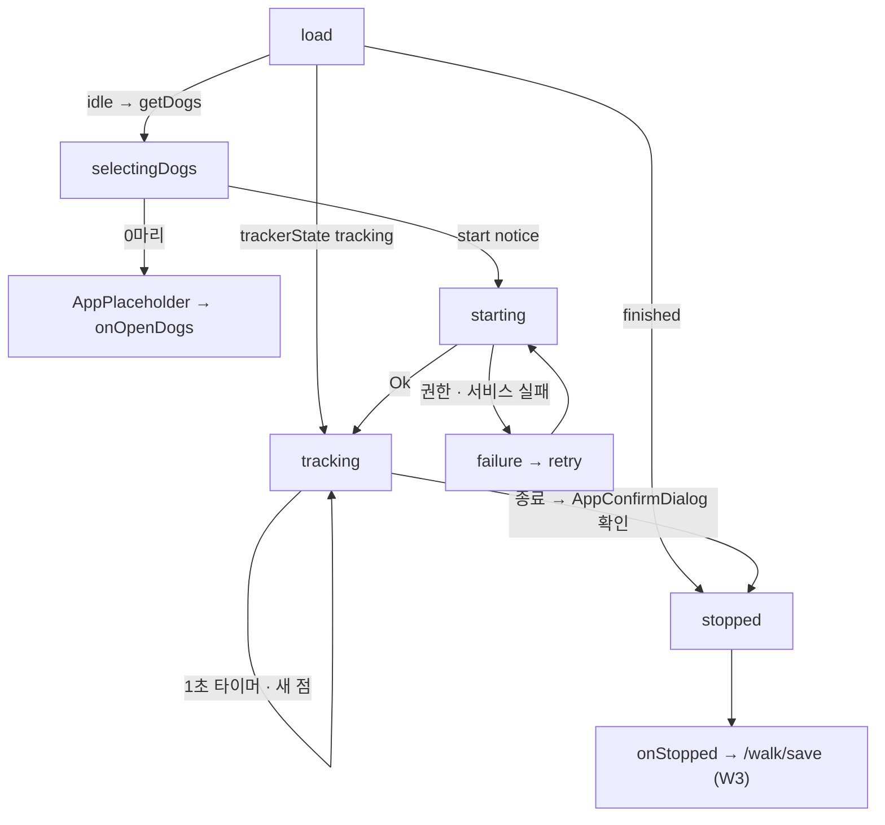

# W2 tracking — 계획 (화면 · 상태 · 완료 조건)

> [pawlog 허브](../../README.md) · [기획 W2](../../overview.md#w2-tracking--산책-추적) · [설계](../../../../../docs/superpowers/specs/2026-10-03-walk-app-design.md) · [구현 기록](history.md) · [테스트](testing.md)

> 상태: 구현 완료 2026-10-03 (추적기 `cdc1ac2` · 화면 `4627805`, 리뷰 반영 `93d722b`) · 에뮬레이터 확인 전 · 진행 상태의 단일 기준은 [진행 현황](../../status.md)

## 범위

산책 **시작 · 종료**, GPS 점 누적, 백그라운드 지속, 지도가 있는 진행 화면과 그 cubit 이다
(개발 단계 ⑤). 도메인은 ① 에서, 권한 선언은 ③ 에서 이미 섰다.

| 이미 있는 것 (W2 가 쓰기만 한다) | 위치 |
|---|---|
| `WalkSession`(`elapsedAt(now)`) · sealed `TrackerState`(`idle` / `tracking` / `finished`) · `TrackingNotice(title, text)` | `packages/features/walk/lib/src/domain/entity/` |
| `WalkTracker`(`current` · `states` · `start` · `stop` · `clear`) | `domain/repository/walk_tracker.dart` |
| `WalkTrackingPolicy.accept` — 정확도 ≤ 50 m(null 통과) · 첫 점 외 이동 ≥ 2 m | `domain/policy/walk_tracking_policy.dart` |
| `trackerState` · `trackerStates` · `startWalk(dogIds, notice)` · `stopWalk()` · `getDogs()` | `WalkUseCase` |
| 강아지 0 → `walkDogRequired`, 추적 중 → `walkTrackingAlreadyActive` | `StartWalkScenario` |
| `TileProvider` lazySingleton(`NetworkTileProvider`) | `di/walk_register_module.dart` |
| 경로 `PawlogPaths.activeWalk = '/walk'` (지금은 `_Placeholder`) | `apps/pawlog/lib/app/router/` |

W2 가 소유하지 않는 것: 저장 폼(W3 — `onStopped` 가 `/walk/save` 로 넘긴다), 피드의 추적 중
배너 `ActiveWalkBanner` 와 FAB(W4), Android 13+ 알림 권한 요청(범위 밖).

## 추적기 계약 (`GeolocatorWalkTracker`)

설계 §3 을 따른다. 구현은 `data/tracker/geolocator_walk_tracker.dart` · `data/location/location_gateway.dart`(통근 앱에서 복사 + `positionStream` · `distanceBetween`).

| 상황 | 결과 |
|---|---|
| `start` · 이미 `tracking` | `Err(walkTrackingAlreadyActive)` |
| `start` · 위치 서비스 꺼짐 | `Err(locationServiceDisabled)` |
| `start` · 권한 denied | 세션당 한 번만 요청(`_requestDeclined`). 거부 · 영구 거부 → `Err(locationPermissionDenied)` |
| `start` · 성공 | `positionStream` 구독 → `tracking(빈 세션)` 방출 → `Ok` |
| 위치 수신 | `distanceBetween(직전 점, p)` → 정책 탈락이면 버림 → 점 추가 · 거리 합산 → `tracking(session)` |
| 스트림 오류 | 세션 유지, `tracking` 그대로(점만 안 쌓인다) |
| `stop` · `tracking` 아님 | `Err(walkNotFound)` |
| `stop` · 성공 | 구독 취소, `endedAt = now` → `finished(session)` → `Ok(session)` |
| `clear` | `finished` 에서만 `idle`. 그 외엔 무시 — W3 폼 버리기가 진행 중 산책을 죽이지 못한다 |

| 플랫폼 | `LocationSettings` |
|---|---|
| Android | `AndroidSettings(accuracy: high, distanceFilter: 3, foregroundNotificationConfig: ForegroundNotificationConfig(notificationTitle: notice.title, notificationText: notice.text, enableWakeLock: true))` |
| iOS | `AppleSettings(accuracy: best, distanceFilter: 3, activityType: fitness, allowBackgroundLocationUpdates: true, pauseLocationUpdatesAutomatically: false, showBackgroundLocationIndicator: true)` |

`states` 는 브로드캐스트라 **현재값을 먼저 내지 않는다.** cubit 은 `trackerState` 를 먼저 읽는다.

## 화면 목록

| 화면 | 경로 | 진입 경로 |
|---|---|---|
| 진행 `ActiveWalkPage` | `/walk` | 피드 FAB · 추적 중 배너(W4). W4 전까지는 주소 직접 이동(`go('/walk')`)으로 확인 |

콜백: `ActiveWalkPage({onStopped, onOpenDogs})`. 앱 셸은 `onStopped` →
`pushReplacement(PawlogPaths.saveWalk)`, `onOpenDogs` → `push(PawlogPaths.dogs)`.

## 화면 상태 — `ActiveWalkState` (sealed)

| 상태 | 조건 | UI |
|---|---|---|
| `selectingDogs(dogs, selectedIds)` · 1마리 이상 | `load()` 에서 `idle` + `getDogs` 성공. **전부 기본 선택** | `DogChips` + `AppButton.primary(walkStart)`. `selectedIds` 가 비면 `onPressed: null` |
| `selectingDogs` · 0마리 | `getDogs` 가 `Ok([])` (마지막 강아지 삭제 후) | `AppPlaceholder(message: walkActiveNoDogsTitle, description: walkActiveNoDogsMessage, actionLabel: walkOpenDogsAction, onAction: onOpenDogs)` |
| `starting` | `start(notice)` 호출 ~ 결과 | 중앙 진행 표시 (권한 다이얼로그가 이 위에 뜬다) |
| `tracking(session, elapsed)` | `start` 성공 · 재진입 · `trackerStates` 의 `tracking` | `RouteMap(follow: true)` + `WalkStatsRow`(경과 시간 · 거리) + `AppButton.primary(walkStop)` → `AppConfirmDialog.show(isDestructive: false, confirmLabel: walkStop)` → 확인이면 `stop()` |
| `stopped(session)` | `stop` 성공 · 재진입 시 `finished` | `BlocListener` → `onStopped()` |
| `failure(failure, dogs, selectedIds)` | `getDogs` · `start` · `stop` 의 `Err` | `AppPlaceholder(message: failure.localizedMessage(context), description: 권한 거부면 walkLocationDeniedHint, actionLabel: commonRetry, onAction: retry)` |

- `retry()` 는 `selectedIds` 가 있으면 `start(notice)` 를 다시, 없으면 `load()` 를 다시 부른다
- `locationPermissionDenied` 재시도는 **이번 세션에 다시 묻지 않는다**(`_requestDeclined`).
  그래서 `walkLocationDeniedHint`("설정에서 위치 권한을 허용해 주세요")를 함께 보인다

## 상태 규칙

| 항목 | 규칙 |
|---|---|
| 진입 | `load()` 가 `trackerState` 를 먼저 본다. `tracking` → 바로 `tracking(session, elapsed)`(재진입, 강아지 조회 생략), `finished` → `stopped(session)`(저장 안 된 세션을 새 산책으로 덮지 않게), `idle` → `getDogs()` → `selectingDogs` |
| 구독 | `load()` 에서 `trackerStates` 구독. `tracking(s)` → `tracking(s, elapsed)`, `finished(s)` → `stopped(s)`. `close()` 에서 해제 |
| 경과 시간 | `tracking` 일 때만 1초 `Timer.periodic` 이 `elapsed = session.elapsedAt(now())` 를 **다시 계산**(틱 누적 금지). `tracking` 을 벗어나거나 `close()` 에서 취소. 시계는 `DateTime Function() now` 주입 |
| 알림 문구 | 페이지가 `TrackingNotice(title: walkTrackingNotificationTitle, text: walkTrackingNotificationText)` 를 만들어 `cubit.start(notice)` 에 넘긴다(cubit 은 l10n 을 모른다) |
| 뒤로 가기 | 추적 중에도 허용(`PopScope` 없음). 추적은 `WalkTracker` 싱글턴에 남는다 |
| 중복 | 모든 `await` 뒤 `isClosed` 검사. `stopped` 는 한 번만 낸다(구독 · `stop()` 결과 중 먼저 온 쪽) |

## 지도 `RouteMap`

| 항목 | 값 |
|---|---|
| 생성자 | `RouteMap({required List<GeoPoint> points, bool follow = false, String? emptyMessage, TileProvider? tileProvider})` — `tileProvider` 가 null 이면 `getIt<TileProvider>()` |
| 레이어 | `FlutterMap` + `TileLayer(urlTemplate: 'https://tile.openstreetmap.org/{z}/{x}/{y}.png', userAgentPackageName: 'com.karma.pawlog', tileProvider)` + `PolylineLayer`(`colorScheme.primary`) + 시작 · 끝 `MarkerLayer` + `SimpleAttributionWidget`(OSM 출처) |
| 점 0개 | 지도를 그리지 않고 `AppPlaceholder(message: emptyMessage)`. 진행 화면은 `walkLocating`("위치를 찾는 중…"), W3 상세는 `walkNoTrack` |
| 첫 화면 | `CameraFit.coordinates(padding: EdgeInsets.all(AppSpacing.lg))`. 점 1개면 그 점 중심 줌 17 |
| 추종 | `follow` 면 `didUpdateWidget` 에서 마지막 점이 바뀔 때 `MapController.move(last, 현재 줌)` |
| 테스트 | `getIt` 에 1×1 투명 PNG 를 메모리에서 주는 stub `TileProvider` 를 등록 — 네트워크를 타지 않는다 |

`WalkStatsRow(distanceMeters, elapsed)` 는 두 칸(라벨 `walkElapsedLabel` · `walkDistanceLabel`).
`DogChips(dogs, selectedIds, onToggle)` 는 `FilterChip` + `AppAvatar(imageFile)`. 둘 다 W3 · W4 가 재사용한다.

## `WalkFormat` (presentation, 순수 함수)

| 함수 | 규칙 | 예 |
|---|---|---|
| `distance(l10n, meters)` | `< 1000` → `walkDistanceMeters(meters.round())`, 그 외 `walkDistanceKm` 소수 1자리 | `850 m` · `1.2 km` |
| `duration(l10n, d)` | 1시간 미만 → `walkDurationMinutes`, 그 외 `walkDurationHoursMinutes` | `23분` · `1시간 5분` |
| `clock(d)` | 1시간 미만 `mm:ss`, 그 외 `h:mm:ss`. 로케일 무관 | `07:05` · `1:02:03` |

진행 화면의 경과 시간은 `clock`, 거리는 `distance`. `duration` 은 W3 · W4 카드용으로 여기서 함께 만든다.

## Presentation

| 이름 | 종류 | 내용 |
|---|---|---|
| `ActiveWalkCubit` | `@injectable`, 페이지 `BlocProvider` | `load()`, `toggleDog(id)`, `start(TrackingNotice)`, `stop()`, `retry()` |
| `ActiveWalkState` | Freezed sealed union | 위 표. `switch` 로 분기 |
| `RouteMap` · `WalkStatsRow` · `DogChips` | `presentation/widget/` | 위 절 |
| `WalkFormat` | `presentation/format/` | 위 절 |

| 위젯 키 | 대상 |
|---|---|
| `walk-active-dog-chip-<id>` | 강아지 칩 |
| `walk-active-start-button` · `walk-active-stop-button` | 시작 · 종료 |
| `walk-active-elapsed` · `walk-active-distance` | 경과 시간 · 거리 값 |
| `walk-active-map` | `RouteMap` |
| `walk-active-retry` | 실패 재시도 |

## 문자열

ko 템플릿 + en · ja, 모든 키에 `@` 설명. `{}` 자리표시자가 있는 키는 `@` 항목에
`placeholders`(타입 포함: `meters` int, `km` String, `minutes` · `hours` int)를 적는다.
이미 있는 `walkAppTitle` · `commonRetry` · `commonCancel`, 실패 문구
`failureLocationPermissionDenied` · `failureLocationServiceDisabled` · `failureWalk*` 는 재사용한다
(`walkDog*` 는 W1 이 추가).

| 키 | ko |
|---|---|
| `walkActiveTitle` | 산책 중 |
| `walkSelectDogs` | 함께 걷는 반려견 |
| `walkStart` · `walkStop` | 산책 시작 · 산책 종료 |
| `walkStopConfirmTitle` | 산책을 끝낼까요? |
| `walkStopConfirmMessage` | 기록을 멈추고 저장 화면으로 이동합니다. |
| `walkElapsedLabel` · `walkDistanceLabel` | 시간 · 거리 |
| `walkDistanceMeters` · `walkDistanceKm` | `{meters} m` · `{km} km` |
| `walkDurationMinutes` · `walkDurationHoursMinutes` | `{minutes}분` · `{hours}시간 {minutes}분` |
| `walkTrackingNotificationTitle` | 산책을 기록하고 있어요 |
| `walkTrackingNotificationText` | 앱을 닫아도 경로가 계속 기록됩니다 |
| `walkActiveNoDogsTitle` · `walkActiveNoDogsMessage` | 먼저 반려견을 등록해 주세요 · 산책에는 반려견이 한 마리 이상 필요합니다 |
| `walkOpenDogsAction` | 반려견 등록하기 |
| `walkLocationDeniedHint` | 설정에서 위치 권한을 허용한 뒤 다시 시도해 주세요 |
| `walkLocating` | 위치를 찾는 중… |

## 플랫폼

③ 에서 이미 선언했다 — Android `INTERNET` · `ACCESS_FINE_LOCATION` · `ACCESS_COARSE_LOCATION` ·
`FOREGROUND_SERVICE` · `FOREGROUND_SERVICE_LOCATION` · `POST_NOTIFICATIONS`, iOS
`NSLocationWhenInUseUsageDescription` · `NSLocationAlwaysAndWhenInUseUsageDescription` ·
`UIBackgroundModes: location`. W2 는 선언을 더하지 않는다.

- Android 13+ `POST_NOTIFICATIONS` 런타임 요청은 v1 에서 **하지 않는다.** 거부 상태면 알림만
  안 보이고 포그라운드 서비스와 추적은 돈다
- iOS 는 기기 검증을 하지 않는다(미검증으로 `history.md` 에 남긴다)

## 완료 조건

- [ ] 에뮬레이터 GPX 재생으로 폴리라인 · 거리 · 경과 시간이 자란다
- [ ] 추적 중 뒤로 가기 → 다시 `/walk` → 같은 세션이 이어진다 (홈 갔다 돌아와도 유지)
- [ ] 홈 버튼으로 30초 백그라운드 → 돌아오면 그동안의 점이 쌓여 있다
- [ ] 위치 권한 거부 · 서비스 꺼짐 → `AppPlaceholder` + 재시도, 같은 세션엔 다시 묻지 않는다
- [ ] 종료 확인 → `onStopped` → `/walk/save`(W3 전까지는 placeholder)
- [ ] tracker · cubit · `WalkFormat` · 페이지 테스트 (`fake_async` 는 dev_dependencies 에 추가)
- [ ] `flutter analyze` 0건, `package_boundary_test` 통과

## 테스트

| 대상 | 시나리오 | 기대 결과 |
|---|---|---|
| `GeolocatorWalkTracker` | 서비스 꺼짐 · 권한 거부(같은 세션 재요청 없음) · 영구 거부 | 각 `Err`, 요청 횟수 1 · 0 |
| `GeolocatorWalkTracker` | 시작 · 플랫폼별 설정 · 점 누적 · 정책 탈락 점 | 빈 `tracking` → 거리 합산, 탈락 점 없음 |
| `GeolocatorWalkTracker` | 추적 중 `start` · 비추적 `stop` · `stop` · `clear` · 스트림 오류 | `walkTrackingAlreadyActive` · `walkNotFound` · `finished(endedAt)` · `finished` 에서만 `idle` · `tracking` 유지 (10건) |
| `ActiveWalkCubit` | `idle` + 2마리 | `selectingDogs(전부 선택)` |
| `ActiveWalkCubit` | 반려견 0마리 | `selectingDogs([], {})` |
| `ActiveWalkCubit` | 추적 중 재진입 | `getDogs` 없이 `tracking` 으로 시작 |
| `ActiveWalkCubit` | `fakeAsync` 로 3초 경과 | `elapsed` 1 · 2 · 3초로 갱신, `close()` 뒤 갱신 없음 |
| `ActiveWalkCubit` | `start` 가 `locationPermissionDenied` | `starting` → `failure(선택 유지)` |
| `ActiveWalkCubit` | `stop()` 성공 | `stopped(session)` 한 번 |
| `WalkFormat` | 999 m · 1000 m · 1250 m, 59분 · 65분, 7분 5초 · 1시간 2분 3초 | `999 m` · `1.0 km` · `1.3 km`, `59분` · `1시간 5분`, `07:05` · `1:02:03` |
| `ActiveWalkPage` | 칩을 모두 해제 | 시작 버튼 비활성 |
| `ActiveWalkPage` | 추적 중(stub `TileProvider`) | 지도 · 경과 시간 · 거리 표시 |
| `ActiveWalkPage` | 종료 → 확인 / 취소 | `stopWalk` 후 `onStopped` / 호출 없음 |
| `ActiveWalkPage` | 0마리 → 버튼 | `onOpenDogs` |

페이지 테스트는 `getIt` 에 mock `WalkUseCase` · stub `TileProvider` 를 등록하고
`tearDown(getIt.reset)`, `Locale('ko')`.

## 범위 밖

- 일시정지 · 재개
- 앱이 죽은 뒤 진행 중 산책 복구 (점은 메모리에만 있다)
- 알림 권한 요청(`permission_handler`)
- 멈춰 있으면 자동 종료
- OSM 타일 캐시 · 오프라인 — [기획 §9 남은 판단](../../overview.md#남은-판단-착수-시-결정)
- 속도 · 페이스 표시
