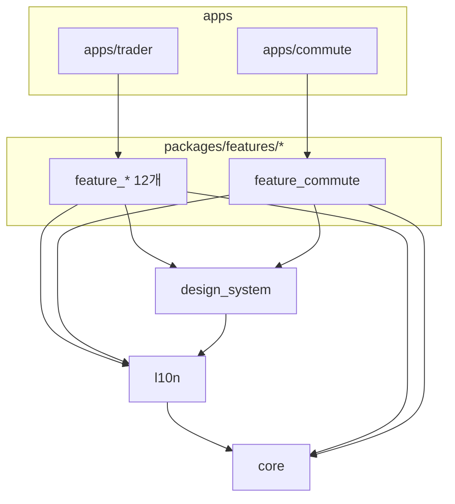
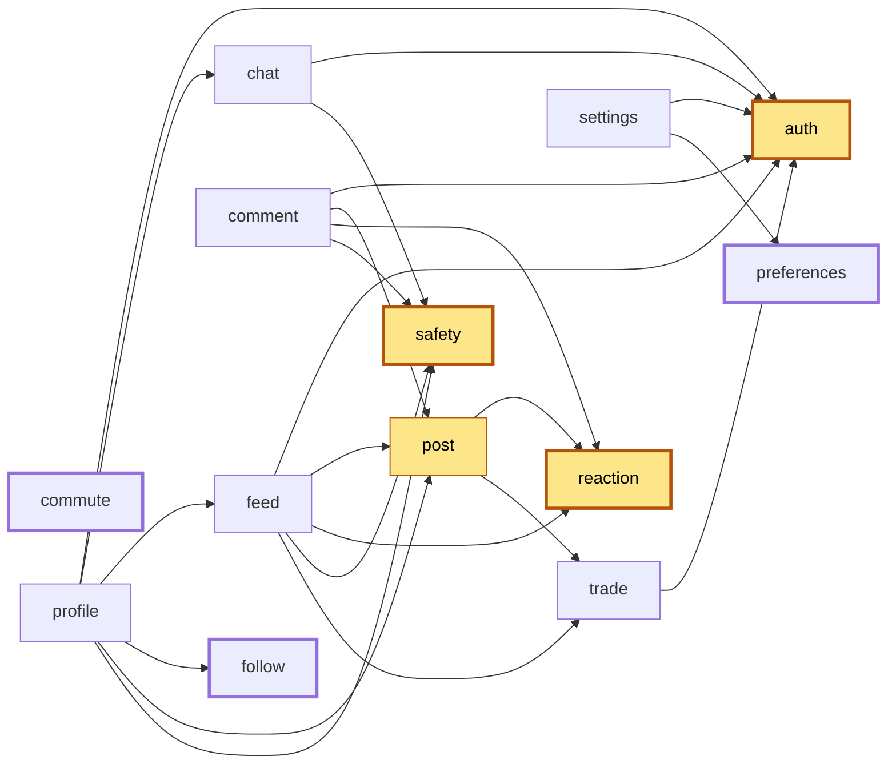
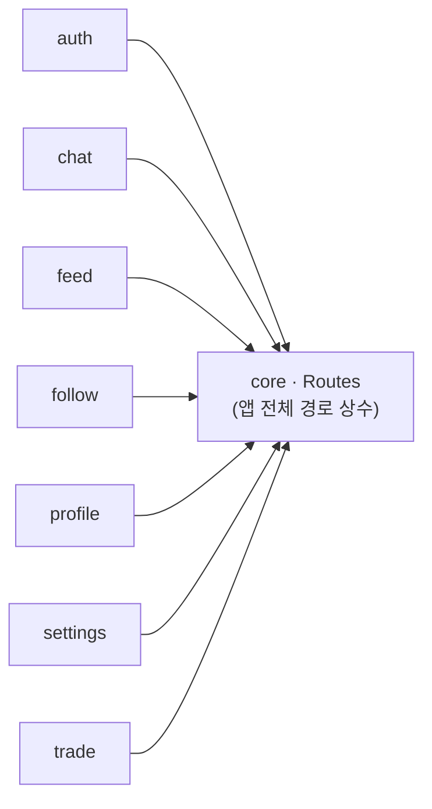

# 패키지 의존 그래프

> [문서 허브](README.md) · [아키텍처](architecture.md) · 2026-09-13 작성 · `packages/**/pubspec.yaml`에서 뽑은 그래프
> (다시 그리는 방법은 [§6](#6-다시-그리기))

이 문서는 **지금 코드가 실제로 어떻게 얽혀 있는지**를 적는다. 어떻게 얽혀야 하는지(규칙)는
[아키텍처 §3-⑥](architecture.md#⑥-feature-간-참조는-최소로), 어떻게 풀 것인지(계획)는
[통근 앱 설계 §7](superpowers/specs/2026-09-13-commute-app-design.md#7-리팩터링-후보--이-앱을-만들며-확인된-것)에 있다.

## 1. 계층



의도한 방향은 `apps → features → {design_system, l10n} → core` 하나뿐이다. 이 그림에서
문제는 없다 — 문제는 `features` 상자 **안쪽**에 있다.

## 2. feature 간 의존 (pubspec 기준)

화살표는 "→ 를 import한다". 굵은 테두리가 아무것도 의존하지 않는 **리프**다.



순환은 없다(DAG). 노란 노드가 **허브**(3개 이상이 의존)다.

### 허브 — 몇 개가 나를 의존하나

| 패키지 | 직접 의존하는 곳 | 수 |
|---|---|---|
| `auth` | chat, comment, feed, profile, settings, trade | **6** |
| `safety` | chat, comment, feed, profile | 4 |
| `post` | comment, feed, profile | 3 |
| `reaction` | comment, feed, post | 3 |
| `trade` | feed, post | 2 |
| `chat` · `feed` · `follow` · `preferences` | profile / profile / profile / settings | 1 |

### 전이 의존 — 하나를 가져오면 몇 개가 딸려오나

pubspec에 적힌 직접 의존만 보면 과소평가한다. 실제로 딸려오는 전체는 이렇다.

| 패키지 | 직접 | 전이 포함 전체 | 수 |
|---|---|---|---|
| `profile` | 6 | auth, chat, feed, follow, post, reaction, safety, trade | **8 / 12** |
| `feed` | 5 | auth, post, reaction, safety, trade | 5 |
| `comment` | 4 | auth, post, reaction, safety, trade | 5 |
| `post` | 2 | auth, reaction, trade | 3 |
| `chat` | 2 | auth, safety | 2 |
| `settings` | 2 | auth, preferences | 2 |
| `trade` | 1 | auth | 1 |
| `auth` · `follow` · `preferences` · `reaction` · `safety` · `commute` | 0 | — | 0 |

`profile` 하나를 쓰려면 feature 12개 중 8개가 온다. 둘째 앱이 "프로필 화면만" 가져다 쓰는
것은 사실상 불가능하다.

## 3. 의존의 성격 — 같은 화살표가 아니다

pubspec의 화살표는 전부 같아 보이지만 코드를 열면 **세 종류**고, 푸는 방법도 각각 다르다.

### ① 세션 조회가 `auth` 의존으로 위장돼 있다

`auth`를 의존하는 6곳 중 5곳(`settings` 제외)이 쓰는 것은 로그인 기능이 아니라
**"지금 누가 로그인했나"** 하나다. 전부 같은 모양이다:

```dart
switch (context.watch<AuthBloc>().state) {
  AuthAuthenticated(:final user) => user.id,   // 또는 user.nickname, user.avatarUrl
  _ => null,
}
```

| 소비자 | 위치 | 쓰는 것 |
|---|---|---|
| chat | `chat_room_page.dart`, `create_room_page.dart`, `join_room_sheet.dart` | `user.id` |
| comment | `post_comments_page.dart` | `user.id/nickname/avatarUrl` → `PostAuthor` |
| feed | `feed_page.dart` | 같음 |
| trade | `trade_result_page.dart` | `user.id` (내 판인지) |
| profile | `profile_page.dart`, `edit_profile_page.dart` | `user` |
| settings | cubit·page 전반 | **진짜 auth 기능**(비밀번호 변경·탈퇴) — 여기만 정당한 의존 |

`AuthBloc`은 로그인·가입·비밀번호 재설정 화면까지 품은 배럴이다. 소비자가 원하는 건
읽기 전용 세션 모델(`AppUser`)뿐이다. **이걸 `core`(또는 `session` 패키지)로 내리면 6개
엣지 중 5개가 사라진다.**

### ② 진짜 공유 도메인 타입

| 화살표 | 공유되는 타입 | 어디서 |
|---|---|---|
| post → trade | `TradeResultSummary`, `TradeResultCard` | `Post` 엔티티가 판 결과를 품는다 |
| comment → post | `Post`, `PostAuthor`, `PostRepository` | 댓글은 게시물 없이 의미가 없다 |
| feed → post | `Post`, `PostAuthor`, `PostTile` | `FeedPost = Post + PostAuthor` |
| comment · feed · post → reaction | `ReactionSummary`, `ReactionTarget`, `ReactionBar` | 좋아요 수와 버튼 |
| profile → follow | `FollowRelation` | 프로필이 팔로우 수를 품는다 |

이건 위장이 아니라 도메인의 사실이다. 없앨 수 없고 **어디에 둘지**(공유 도메인
패키지로 내릴지, 각자 로컬 타입을 갖고 경계에서 매핑할지)만 정하는 문제다.

### ③ 화면 조립이 패키지 안에 들어와 있다

| 화면 | 직접 import해서 배치하는 것 |
|---|---|
| `profile/profile_page.dart` | chat(DM 진입), feed(내 글 목록), follow(팔로우 버튼·목록), post(`PostTile`), safety(신고·차단) |
| `feed/feed_page.dart`, `post_tile_actions.dart` | post(`PostTile`), safety(신고 시트), reaction(`ReactionBar`) |
| `comment/post_comments_page.dart` | safety(신고), reaction(`ReactionBar`) |
| `chat/chat_room_page.dart` | safety(차단) |

`safety`·`reaction`은 "있으면 붙는" 기능인데 소비자가 import한다. 이 조립은 원래 app
레이어의 일이다 — **app이 위젯·콜백을 주입하면 feed는 safety를 몰라도 된다.**
`feature_commute`가 go_router 없이 콜백만 받는 것은 이 방식의 대조 실험이다.

## 4. 라우팅 결합 — pubspec에 보이지 않는 의존

`core`의 `Routes`([routes.dart](../packages/core/lib/src/navigation/routes.dart))에
트레이더 앱 **전체** 경로 상수가 있고, feature들이 다른 feature의 화면으로 직접 이동한다
(`context.push(Routes.chatRoomPath(...))` 등 19곳). pubspec 의존이 없는 쌍에서도 화면
이동으로 결합돼 있어, 재사용 관점에서는 pubspec 화살표보다 이게 더 질기다.



## 5. 기반 패키지의 숨은 결합

"기반만" 쓰는 앱(`apps/commute`)이 실제로 물려받는 것:

| 패키지 | 결합 | 결과 |
|---|---|---|
| `core` | `supabase_flutter`·`image_picker`·`flutter_image_compress`·`flutter_secure_storage` 의존, `CorePackageModule`이 `SupabaseClient` 등록 | Supabase를 안 쓰는 앱도 전부 딸려온다 (lazy 등록이라 초기화 없이 돌긴 한다) |
| `core` | `FailureCode` enum이 post·comment·report 등 feature 전용 코드를 품음 | feature 하나 추가할 때 `core`를 고친다 |
| `l10n` | 단일 ARB(`app_ko/en/ja.arb`), `FailureCode` switch가 exhaustive | 모든 앱이 모든 앱의 문자열을 싣는다. `FailureCode` 추가 시 `l10n`도 고친다 |
| `design_system` | `l10n` 의존 | 버튼 하나 쓰려고 트레이더 문자열 전부를 들고 온다 |

## 6. 다시 그리기

§2의 엣지·허브·전이 표는 아래로 뽑는다. 결과가 이 문서와 다르면 문서를 갱신한다.

```bash
python3 - <<'PY'
import re, pathlib, collections
root = pathlib.Path('packages/features')
edges = {}
for p in sorted(root.iterdir()):
    deps = (p/'pubspec.yaml').read_text().split('dev_dependencies:')[0]
    edges[p.name] = sorted(re.findall(r'^\s+feature_([a-z]+): any', deps, re.M))
for k, v in edges.items():
    for d in v: print(f'  {k} --> {d}')
print('in-degree:', collections.Counter(d for v in edges.values() for d in v).most_common())
def closure(n, seen=None):
    seen = seen if seen is not None else set()
    for d in edges[n]:
        if d not in seen: seen.add(d); closure(d, seen)
    return seen
for k in edges: print(f'{k}: {sorted(closure(k))}')
PY
```

§3·§4의 근거는 import 검색으로 확인한다:

```bash
grep -rlE "package:feature_" packages/features/*/lib --include="*.dart"
grep -rnE "context\.(push|go)\(Routes\." packages/features/*/lib --include="*.dart"
```
