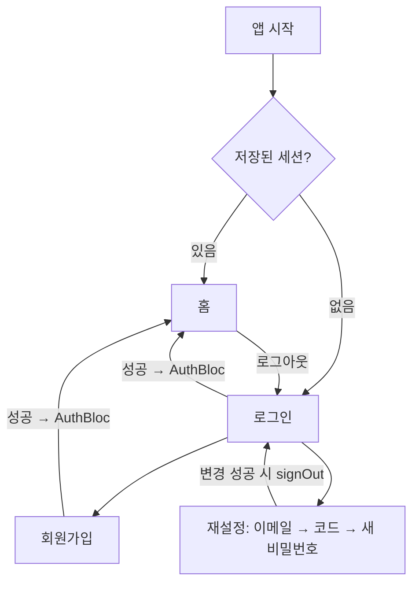

# F1 auth — 계획 (화면 · 상태 · 완료 조건)

> [문서 허브](../../README.md) · [기획 F1](../../overview.md) · [구현 기록](history.md) · [테스트 범위](../../testing/features/auth.md)

> 상태: **구현 완료** (2026-08-21) · 이 문서는 완료 후 소급 작성했다.
> 이후 feature는 착수 전에 이 형식으로 먼저 쓴다.

## 범위

이메일 + 비밀번호 회원가입 · 로그인 · 로그아웃 · 자동 로그인 · 비밀번호 재설정(6자리 코드).
의도와 데이터·권한 설계는 [기획 F1](../../overview.md)이 기준이다.

## 화면 목록

| 화면 | 역할 | 진입 경로 |
|---|---|---|
| 로그인 | 이메일·비밀번호 입력, 가입·재설정 화면으로 이동 | 미인증 상태의 기본 화면 (라우터 리다이렉트) |
| 회원가입 | 이메일·비밀번호·닉네임 입력 | 로그인 화면에서 이동 |
| 비밀번호 재설정 | 3단계: 이메일 입력 → 코드 입력 → 새 비밀번호 | 로그인 화면에서 이동 |

화면은 직접 이동하지 않는다 — `AuthBloc` 상태 변화를 라우터 `redirect`가 반영한다
([구현 기록 · 설계 판단](history.md)).

## 화면별 상태

| 화면 | 상태 | UI |
|---|---|---|
| 공통 | 제출 중 | 버튼 비활성 + 로딩 표시. 제출 중 재요청은 무시 |
| 공통 | 실패 | 필드 오류는 필드 아래, 서버 오류는 사용자 문구로 표시 |
| 로그인 | 인증 실패 | "이메일 또는 비밀번호가 올바르지 않습니다" (원인 구분 금지 — 계정 열거 방지) |
| 회원가입 | 닉네임 중복 | 디바운스 사전 확인 + 가입 시 DB 제약 오류(`23505`) 문구 매핑 |
| 재설정 | 단계 전환 | 코드 발송 성공 시에만 다음 단계. "이메일 다시 입력"으로 1단계 복귀 |

## 입력 검증

- 이메일: 형식 검사
- 비밀번호: 최소 길이 검사
- 닉네임: 길이 2~20자 (최종 판정은 DB CHECK · `lower(nickname)` 유니크 인덱스)
- 제출 후에는 입력하는 대로 재검증 (`autovalidateMode: onUserInteraction`)

## 흐름

재설정의 `verifyOTP` 성공 세션은 로그인으로 취급하지 않는다
(`passwordRecovery` 가드 — [구현 기록](history.md)).

## 완료 조건

- [x] 빈 폼 제출 → 필드별 오류 표시
- [x] 잘못된 비밀번호 → 원인을 구분하지 않는 실패 문구
- [x] 로그인 성공 → 홈 자동 이동, 프로필(닉네임) 조인 정상
- [x] 앱 강제 종료 후 재실행 → 로그인 화면 없이 홈 (세션이 Keychain에 유지)
- [x] 로그아웃 → 로그인 화면 리다이렉트
- [x] 회원가입 → 홈 자동 이동, `profiles` 행 생성
- [x] 닉네임 중복(대소문자 무시) → 가입 차단
- [x] 재설정 전 과정: 코드 발송 → Mailpit 수신 → 검증 → 새 비밀번호로 로그인
- [x] 재설정 코드 검증 시점에 홈으로 튕기지 않음 (passwordRecovery 가드)

검증 결과와 남은 항목(SMTP · 이메일 확인 · iOS)은 [구현 기록](history.md)에 있다.
