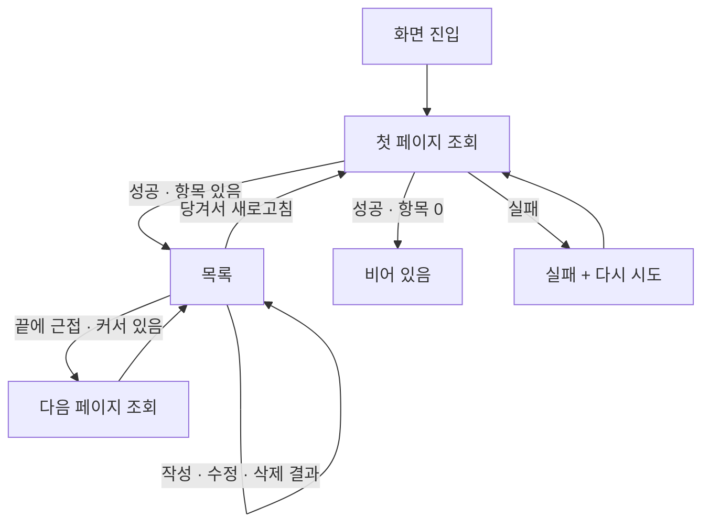

# F4 feed — 계획 (화면 · 상태 · 완료 조건)

> [문서 허브](../../README.md) · [기획 F4](../../overview.md) · [구현 기록](history.md) · [테스트 범위](../../testing/features/feed.md)

> 상태: **1단계 범위 구현 완료** (2026-08-22) · 이 문서는 완료 후 소급 작성했다.
> 팔로잉 피드는 3단계 범위이며 아래 "범위 밖"에 적어 둔다.

## 범위

전체 공개 피드의 **목록 조회**만 담당한다. 최신순 커서 페이지네이션, 무한 스크롤,
당겨서 새로고침, 그리고 항목마다 작성자 표시까지다.

게시물의 작성·수정·삭제는 [post](../post/history.md) 가 소유한다. 피드는 그 결과를
목록 상태에 반영만 한다. 의도와 데이터·권한 설계는 [기획 F4](../../overview.md)가 기준이다.

## 화면 목록

| 화면 | 역할 | 진입 경로 |
|---|---|---|
| 피드 | 최신 게시물 목록, 작성 진입, 본인 글 수정·삭제 메뉴 | 인증된 상태의 기본 화면 (`/`) |
| 둘러보기 (게스트) | 비로그인 읽기 전용 전체 피드. 반응·댓글·게시물 탭은 가입 안내 시트 → 회원가입 / 로그인 | 로그인 화면의 "먼저 둘러보기" (`/explore`, 공개 경로) |

별도 화면은 없다. 작성·수정 화면은 post 가 소유하고, 피드는 `push` 결과를 받아
목록에 반영한다.

## 화면 상태

| 상태 | 조건 | UI |
|---|---|---|
| 로딩 | 첫 조회 중 | 화면 중앙 진행 표시 |
| 비어 있음 | 조회 성공 · 항목 0개 | "아직 작성된 게시물이 없습니다." + 당겨서 새로고침 가능 |
| 비어 있음 (팔로잉) | 팔로잉 탭 · 항목 0개 | "팔로우한 사람이 없습니다" + "사람 둘러보기" 버튼 → 전체 탭으로 이동 |
| 목록 | 조회 성공 · 항목 1개 이상 | 카드 목록. 본인 글에만 `⋮` 메뉴 |
| 추가 로딩 | 끝에서 240px 이내 도달 · 다음 커서 있음 | 목록 하단 진행 표시 |
| 마지막 페이지 | 다음 커서 없음 | 추가 요청을 보내지 않는다 |
| 실패 | 조회 실패 | 실패 문구 + "다시 시도" |

추가 로딩이 실패하면 이미 읽은 목록을 지우지 않는다. 진행 표시만 걷고 그대로 둔다 —
스크롤하다 잠깐 끊겼다고 읽던 자리가 사라지면 안 된다.

## 목록 항목

카드 하나는 **게시물 + 작성자**다 (`FeedPost`).

| 요소 | 값 | 없을 때 |
|---|---|---|
| 아바타 | `author.avatarUrl` | 닉네임 첫 글자 (`AppAvatar` 기본 동작) |
| 닉네임 | `author.nickname` | `profiles.nickname` 은 not null 이라 항상 있다 |
| 내용 | `post.content` (최대 3줄) | — |
| 시각 | `post.updatedAt` | — |
| `⋮` 메뉴 | 본인 글일 때만 (수정 · 삭제) | 남의 글에는 표시하지 않는다 |

작성자는 목록 조회가 **한 번에** 내려준다. 목록을 받은 뒤 작성자를 조회하는 경로를
두지 않는다 — 이유와 방식은 [구현 기록](history.md)에 있다.

## 목록 갱신 규칙

전체 재조회는 하지 않는다. 스크롤 위치와 읽던 자리가 사라지기 때문이다.

| 사건 | 반영 | 작성자 |
|---|---|---|
| 작성 성공 | 목록 맨 앞에 추가 | 본인이므로 세션 값으로 만든다 |
| 수정 성공 | 같은 id 항목의 게시물만 교체 | 기존 값을 그대로 둔다 (수정으로 바뀌지 않는다) |
| 삭제 성공 | 같은 id 항목 제거 | — |
| 목록을 읽기 전 | 무시한다 | — |

## 흐름

## 완료 조건

- [x] 앱을 열면 최신 게시물이 시간순으로 보인다
- [x] 아래로 내리면 다음 페이지를 이어 붙인다
- [x] 마지막 페이지에서는 추가 요청을 보내지 않는다
- [x] 경계에서 중복·누락이 없다 (`created_at` 동일 항목은 `id` 로 순서를 가른다)
- [x] 당겨서 새로고침으로 첫 페이지를 다시 읽는다
- [x] 삭제된 게시물은 목록에 오지 않는다 (조회 RLS 가 가린다)
- [x] 카드에 작성자 닉네임과 아바타가 보인다
- [x] 작성·수정·삭제 결과가 재조회 없이 목록에 반영된다
- [x] 수정해도 카드의 작성자 표시가 유지된다
- [x] 비로그인 사용자가 로그인 화면의 "먼저 둘러보기" 로 전체 피드를 읽기 전용으로 본다.
      반응·댓글·게시물 탭은 가입 안내 시트로 간다 (`supabase/tests/guest_read_check.py`)
- [x] 팔로잉 탭이 비어 있으면 "사람 둘러보기" 로 전체 탭에 간다
- [ ] `created_at` 이 같은 게시물이 여러 개일 때 끊어 읽기를 로컬 Supabase 로 확인
      ([테스트 범위](../../testing/features/feed.md) 마지막 문단)

## 범위 밖

이 단계에서 하지 않는다. 붙일 자리는 [구현 기록](history.md)에 적어 뒀다.

- 팔로잉 피드 탭 (3단계 · F8 follow 이후)
- 반응 수 · 댓글 수 · 내 반응 상태 (2단계 · F5 · F6)
- 차단한 사용자 게시물 제외 (2단계 · F7)
- 게시물 이미지 (F3 잔여 범위)
- 작성자 이름을 눌러 타인 프로필로 이동 (F2 잔여 범위)
